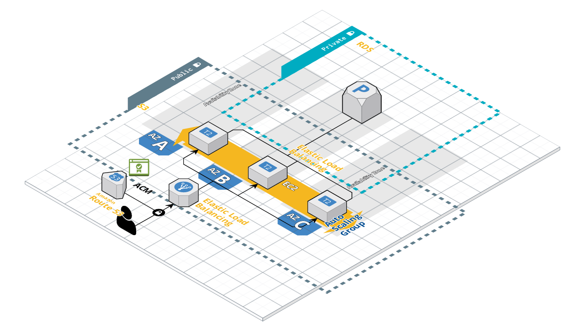

NOTE:
TODO - enable HTTPS connection to the ALB, waiting for the validation of the ACM


## Requirements

- Please create an nginx web service that utilizes multi-AZ in AWS. This Web service must only be accessible from NAB's public IPs (using your current public IP is also fine).
- Create an RDS server that's accessible to the web servers.
- All configurations must be as secure as possible (think of what you need to do to make everything secure).
- The web server needs to scale on-demand; when CPU load hits 65% or higher it needs to scale up, when it's 40% or lower it needs to scale down.


# Terraform setup for Networking, Nginx Server, and RDS

This repository contains a complete deployment for an Nginx server, deployed in multi-AZ using an RDS Postgres the below diagram can give a comprehensive view of what this repo achieves



there are some values that you can customize of this deployment and you can find them in the `terraform.tfvars` file.


## The deployment is divided in three modules:

### 1. Network

The network module creates a VPC for a given CIDR block along with private and public subnets that are defined as a map in the `terraform.tfvars` file

### 2. App

The app module creates the ALB, ASG and the Launch template needed to spin up EC2 instance with a nginx server on it

### 3. Dbs

The db module creates the DB postgres with the values given in the `terraform.tfvars`


## Below are the inputs required for the deployment setup

### Global Vars
| Name | Description | Type | Default | Required |
|------|-------------|------|---------|----------|
|prefix_resources_name|prefix that will be used for all resources creation|`map`| |no|
|other_tags|Aditional tags you can add to all resources|`string`| |no|

### Module Network Vars
| Name | Description | Type | Default | Required |
|------|-------------|------|---------|----------|
|vpc_cidr_block|cicd used for the creation of the VPC|`string`| |yes|
|subnet_cicd_az_name|subnets details such as AZs and cicd blocks|`map`| |yes|


### Module App
| Name | Description | Type | Default | Required |
|------|-------------|------|---------|----------|
|asg_target_value|CPU load average target value for the ASG|`number`| |yes|
|image_ami_id|id of the AMI base for the EC2 instances|`string`| |yes|
|ec2_instance_type|instance type to use in the EC2|`string`| |yes|

### Module DBs
| Name | Description | Type | Default | Required |
|------|-------------|------|---------|----------|
|rds_instance_class|instance type to use in the DB|`string`| |yes|
|rds_allocated_storage|storage size for the DB|`number`| |yes|
|rds_username|Username for the DB|`string`| |yes|
|rds_db_name|Initial DB name|`string`| |yes|
|rds_public_access|setup the DB with public access|`bool`| |yes|
|rds_skip_final_snapshot|Avoid final snapshot when DB is destroyed|`bool`| |yes|


   


## How to test load of CPU to trigger autoscaling.

run the following command in any of the instances, you can connect to the instance using session manager:

```
seq 3 | xargs -P0 -n1 md5sum /dev/zero &
```

to finish the load test run in the same instance the following command

```
killall md5sum
```

## How to connect to the DB

run the following command in any of the instances, you can connect to the instance using session manager:

```
psql \
   --host=jlrm-rds-postgres.ce4bclloh7if.us-east-1.rds.amazonaws.com \
   --port=5432 \
   --username=postgres \
   --password
```

it will promt for the password of the DB which is located in Secret Manager `jlrm-rds-pass`, once you are connected to the DB you can run the following command to list the list of DBs

```
   \
   --dbname=<database name> 
```